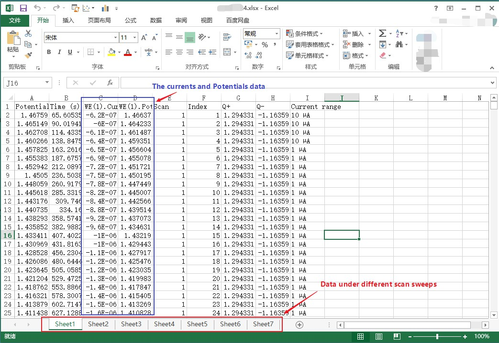
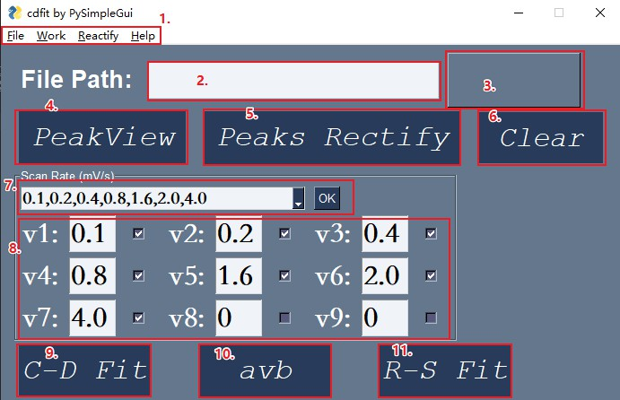

# README.md
利用PySimpleGui重构了GUI

# **简单使用说明**

点击此处跳转到[项目链接](https://github.com/xieshentoken/Capacitance-contribution-fit/tree/Use-PySimpleGui/PySimpleGui)

欢迎提出您宝贵的意见和建议，请联系邮箱:<dhu-hsa@mail.dhu.edu.cn>  

## 1.数据准备
这里以瑞士万通电化学工作站测得数据为例，将得到的不同扫速(这里包含7个扫速)下的数据保存于同一个Excel表格中，不同扫速的数据存在不同sheet中，此处数据不需要作任何处理直接保存即可。  

## 2.数据读取
- 界面说明
  
    
  1.菜单栏  
  2.数据的绝对路径  
  3.文件选择按钮  
  4.读取数据+自动识别峰值  
  5.手动峰值校正  
  6.清除当前读取的数据  
  7.预设的扫速值  
  8.扫速选择框  
  9.电容贡献拟合按钮  
  10.b值拟合按钮  
  11.扩散系数拟合按钮  
- 读取数据  
  点击Browse按钮选择准备好的Excel文件，在菜单栏中Rectify下拉菜单中点击"Number of data dots"设置数据点数(默认为2455个，该默认值可以在配置文件config.py中进行更改)。  
  选择正确文件后，点击"C-D Fit"读取数据并拟合赝电容。
- 识别氧化还原峰  
  导入数据并选择扫速后，点击PeakView读取数据，软件会自动寻峰并且显示结果。寻峰结果常常不准确，需要手动校正。  
- 校正峰值  
  点击Peaks Rectify按钮来手动输入峰值，在精确度要求不高时，可以在显示的寻峰结果图上依据坐标右下角的x，y值来粗略读取峰值；当然可以通过其他软件辅助得到精确峰值后输入。

## 3.拟合不同扫速下的电容贡献值
依据公式：$\frac{i}{\nu^\frac12}=k_1\nu^\frac12+k_2$，左键单击C-D Fit按钮拟合得到各个扫速下赝电容反应的曲线，再右键单击C-D Fit按钮，依据面积比得到各扫速下的电容贡献值。在菜单栏中可以保存拟合结果。
## 4.拟合b值  
得到正确峰值后，点击AVB按钮可以依据公式：$i=a\nu^b$&$、log_{10}(i)=b\log_{10}(\nu)+\log_{10}(a)$拟合b值,右键单击AVB按钮或在菜单栏中保存数据
## 5.依据Randles-Sevcik方程求离子扩散系数  
依据可逆体系的Randles-Sevcik方程：

$I_p=(0.4463nFA\sqrt{\frac{nF}{RT}}\Delta c_0\sqrt{D_{Na^+}})\cdot\sqrt{\nu}$  
对扫速的开方及峰值电流线性拟合得到的斜率相对大小即代表了离子扩散系数的相对大小，寻峰后单击R-S Fit按钮进行拟合，再次右键单击或在菜单栏中保存数据。
## 6.保存数据
拟合结果并出图后，可以右键单击或菜单栏中可以保存拟合数据。
## 7.注意事项
- 点击Browse按钮选择原始数据后，点击菜单栏Rectify-Number of data dots设置每一扫速下的数据点数(默认为2448个，即电化学窗口为3v下autolab的默认取点数，更改步长后该值会发生变化)，Interval设置拟合时的取点间隔(默认为1，即全部选择)，选择的扫速个数不能多于Excel中总的Sheet数；
- Excel中必须仅包含测试数据，不要插入包含其他数据的Sheet或空Sheet；
- 第一次选择数据后如果要更改扫速，扫速不得多于第一次的扫速个数。
